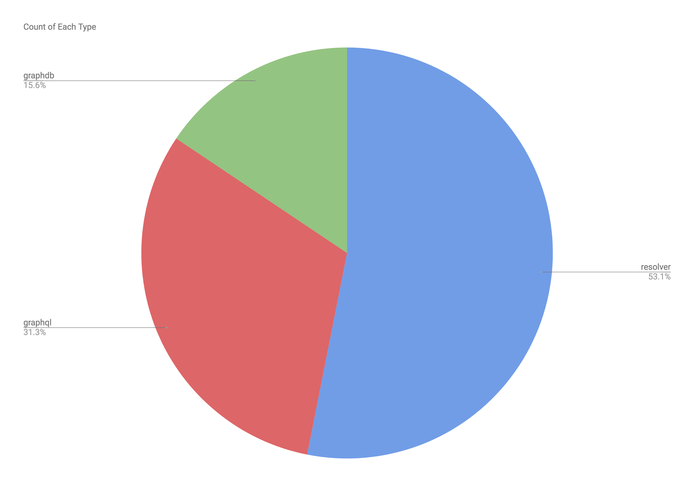
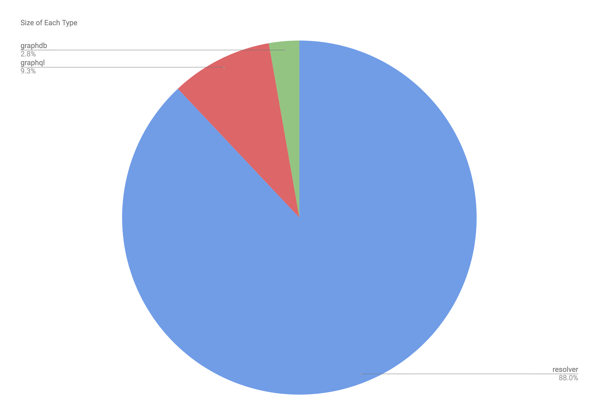
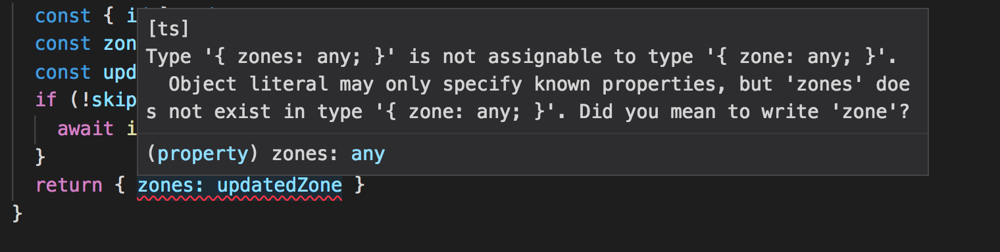

theme: Francis Bustle Deckset
autoscale: true
footer: 

# The Typescript Sandwich 🥪
[.hide-footer]
----

# Gradius has 3 layers

----

# Gradius has 3 layers

- 🍞 GraphQL Objects
- 🥩 Resolvers
- 🥖 GraphDB Objects

^ weird having two kinds of bread
---

# Gradius is more like a Monte Cristo

- 🍞 GraphQL Input Objects
- 🥩 Resolvers
- 🥓 GraphDB Objects
- 🥩 Resolvers
- 🍞 GraphQL Output Objects

^ deep fry it in webpack, serve it up on lambda

---



---



---

# Less 🐛 in our 🥩 the better

---

# Lets make Resolvers Typescript?

---

```js

export async function updateCarouselZone(
  input,
  { skipAsyncEvents } = {}
) {
  const { id } = input
  const zone = await graph.CarouselZone.FIND(id, BadRequestError)
  const updatedZone = await graph.CarouselZone.update(input)
  if (!skipAsyncEvents) {
    await indexNodeAsync(zone)
  }
  return { zones: updatedZone }
}
```

---


```typescript
export async function updateCarouselZone(
  input: any,
  { skipAsyncEvents } = { skipAsyncEvents?: bool }
) {
  const { id }: { id: string|number } = input
  const zone: any = await graph.CarouselZone.FIND(id, BadRequestError)
  const updatedZone: any = await graph.CarouselZone.update(input)
  if (!skipAsyncEvents) {
    await indexNodeAsync(zone)
  }
  return { zones: updatedZone }
}
```

---

# 🐛 Not helpful

---

# Type the Data in 🐦
# Type the Data out 🐧
# Chase the 🐛

---

# Data In 🐦

---

# 🐦 GraphQLInput Objects

```js
input UpdateCarouselZoneInput {
  id: ID!
  title: String
  description: String
  display: ZoneDisplayType
  clientMutationId: String
}

```

---
# 🐦 GraphQLInput Objects

```typescript
interface UpdateCarouselZoneInput {
  id: GUID
  title?: string
  description?: string
  display?: 'FULL_BLEED' | 'INLINE'
  clientMutationId?: string
}

```

---

# 🐧 GraphQLOutput Objects

```js
type CarouselZone implements Node & Zone {
  /* mix of code and data */
}

type UpdateCarouselZonePayload {
  zone: CarouselZone!
  clientMutationId: String
}

```

---


# 🐧 GraphQLOutput Objects

```typescript
interface CarouselZone {
  id: GUID
  [key: string]: any // to type another day
}

interface UpdateCarouselZonePayload {
  zone: CarouselZone
  clientMutationId?: string
}

```

---


```typescript
export async function updateCarouselZone(
  input: GraphQL.UpdateCarouselZoneInput,
  { skipAsyncEvents } = { skipAsyncEvents?: bool }
): Promise<GraphQL.UpdateCarouselZonePayload> {
  const { id } = input // knows id is guaranteed and a GUID
  const zone: any = await graph.CarouselZone.FIND(id, BadRequestError)
  const updatedZone: any = await graph.CarouselZone.update(input)
  if (!skipAsyncEvents) {
    await indexNodeAsync(zone)
  }
  // ERROR! UpdateCarouselZonePayload requires a `zone` field not a `zones` field
  return { zones: updatedZone }
}
```

---




---

# 🐛🦅

---

# Next Challenges 🚨

- Mixing of data and code in view types
- Functional approach to Resolvers
- No way to Type the data input for the GraphQL Node Objects

---

# Next Challenges 🚨

- GraphDB needs types in JS and TS and that's annoying
- GraphDB needs more validations then types

---

# 👋 🐛
