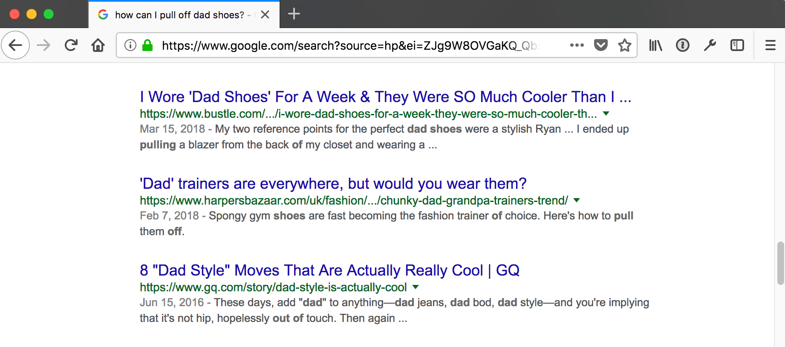

theme: ED Fonts JS-Conf
autoscale: true

# I 👋 Francis

---

## reconbot


---

# I 💻 

---

> Hey Francis, How did everyone at Bustle make the website so fast?
--People

---

> We put everything in Redis.
--Francis

^ this didn't cut it so I made a talk

---

# We live in Memory

^a nice way of saying this is

---

## λ, Graphql, and Redis In Under 70ms

---

# API Response Time


---


___

# Story Arc

1. What is bustle doing
2. How is bustle doing it
3. How you can do it

---


---

## BDG is the largest reaching publisher for millennial women

^ Bustle itself has more visitors than washingtonpost, theguardian.com, stackexchange.com, imdb.com, even webmd.com (https://www.quantcast.com/top-sites/US) and we're now 5 sites

---


^ And we're growing TODO make this a better screenshot

---

# Platform Goals

- Best reader experience possible
- Best features for our writers and designers

---

# Just like you 👍

---

# Platform Strategies

- Fastest page load
- Reduce the cost of change

^ make it easy to build and test new products and easy to remove old ones, and keep them all really fast

---

> Ok Francis, but how does it work?
-- Get to it already

---


^ CDN, react λ , graphql λ , Redis/ES

---
# Layers

1. CDN
2. Rendering
3. API
4. Database

---

# CDN

Takes an HTTP request and try to give a response out of cache, try really hard.

- API Gateway / Cloudfront
- Cloudflare
- Fastly

---

# The CDN
# Should Execute my Functions

---


^ we have a special need, quick invalidation

---


^ I'm pretty sure we'll be able to drop API gateway and get a faster execution

---

# Rendering

Take an HTTP request, fetch data, and render out { status, body, headers }

- Server Side Render a page
- Client Side Render a page
- Be smart about Loading Stylesheets and Components

---

# Rendering


---

# API

- Take a query and return some data
- Take some input and change state, then return some data
- Be strict about what types we return

---

# API


---

# API


---

# Database

- Store the data safely
- Retrieve the data fast

---

# Database

- Store the data safely
- Retrieve the data fast, in a consistent time

---

# [fit] Redis is our Primary Data Store

---

> Redis is an in-memory **data structure server**. It supports, **hashes**, lists, sets, **sorted sets** with range queries.
-- Redis.io (kinda)

---

> Hey Francis,
> Isn't that really dangerous?
-- 50/50 chance you'll say this

^ if you know redis...

---

> No.
-- 100% chance I'll say this

---

> I don't believe you.
-- 99% chance you're thinking this

---

# Redis Persistance

- 1s fsync of Append Only File (AOF)
- 1 hour snapshot of the Redis Database File (RDB) backed up to S3
- Read replicas ready to take over really fast
- Perfect for our read heavy load

---


^ describe everything, note that elasticsearch is used for searches and related content

---


---


---



---


---

```json
{
  "site": {
    "name": "BUSTLE",
    "__typename": "Site",
    "post": {
      "id": "8031264",
      "__typename": "ArticlePost",
      "title": "I Wore 'Dad Shoes' For A Week & They Were SO Much Cooler Than I Thought",
      "path": "/p/i-wore-dad-shoes-for-a-week-they-were-so-much-cooler-8031264",
      "body": "99% of the JSON you'd be looking at, HI JSCONF!",
      "author": {
        "id": "1910027",
        "__typename": "User",
        "name": "Dale Arden Chong"
      },
      "tags": [
        { "id": "1706155", "__typename": "Tag", "name": "homepage" },
        { "id": "1706162", "__typename": "Tag", "name": "fashion" },
        { "id": "2214803", "__typename": "Tag", "name": "freelancer" }
      ]
    }
  }
}
```


---

```
query postByPath($path: String!, $site: SiteName!) {
  site(name: $site) {
    name
    postByPath(path: $path) {
      id
      __typename
      title
      path
      body
      author {
        id
        __typename
        name
      }
      tags {
        id
        __typename
        name
      }
    }
  }
}
```

---
```json
{
  "site": {
    "name": "BUSTLE",
    "__typename": "Site",
    "post": {
      "id": "8031264",
      "__typename": "ArticlePost",
      "author": {
        "id": "1910027",
        "__typename": "User"
      },
      "tags": [
        { "id": "1706155", "__typename": "Tag" },
        { "id": "1706162", "__typename": "Tag" },
        { "id": "2214803", "__typename": "Tag" }
      ]
    }
  }
}
```
---


---

```
type Post {
  title: String!
  body: MobileDoc!
}

type Page {
  path: String!
  postConnection(sort: "publishedAt"): PostConnection!
}

```

---

# Bustle *loves* to share and fund Open Source but we missed this one.

---


^ The US arcade port of Gradius

---

# This works for bustle and your needs are your needs.png

---


# Install
```
npm i nemesis-db
```

# Features
- Node and Edge Schemas, types and Interfaces
-
- Schemaless Nodes
- Weighted Edges
- Compression

---

Now you can make a fast website!

---

Thats cool, but why is it fast?

---

Thanks!

---

We got some time, so lets make a fast website.


---

# Procrastination is a wonderful motivator
- 2 libraries, 4 typedefs, a short story, and about 16 open source prs made avoiding working on this talk
- Oh and nemesis-db
