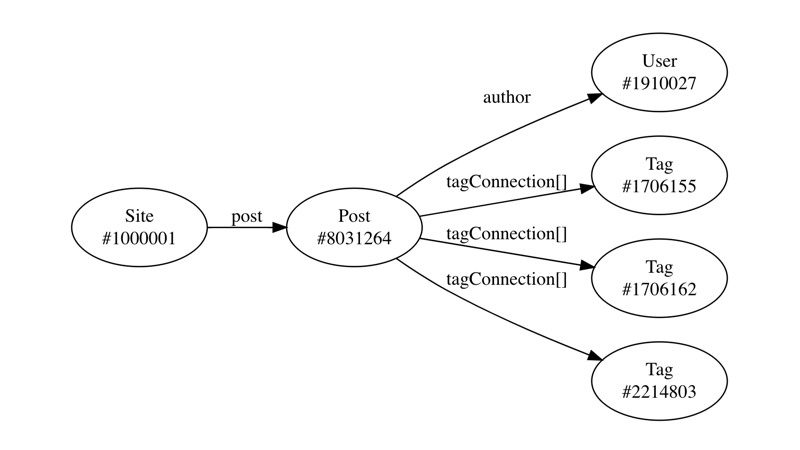

theme: Courier, 2
autoscale: true

# We Live in Memory

---

# I 🤷🏻‍♀️ Francis
# I 💻 

---

## @reconbot


---


> Hey Francis, How did everyone at Bustle make the website so fast?
--People

---

> Oh hey, I know that one. We put everything in redis.
--Francis

---

## Thank you! 👏

[.footer: Francis...]

---

# Redis is our Primary Data Store

### But that doesn't make it fast

---

# We modeled our GraphQL data in a redis GraphDB

^ the modeling is the real reason we're fast

---

> Hey Francis, isn't that really dangerous?
-- 50/50 chance you'll say this

---

> No
-- 100% chance I'll say this

---

> Ok, Thanks
-- You but you don't mean it yet

---

[.build-lists: true]
# [fit] Redis Is our Primary Data Store

- 1s fsync of AOF
- 1 hour snapshot RDB
- Read replica ready to take over really fast
- The 20 minute boot time really sucks (at 40GB)
- Good enough for Bustle's read heavy load

---

# Theory: Modeling GraphQL in redis makes Bustle Fast

---


---


---


---


---


---




---

# GraphDB

^ what if we had a database that let us save and access data like this?

---


---


---

> Oh you mean, like Neo4j right?
-- 99% of you

---

> Sure, but it's faster and doesn't do any of the same things.
-- Francis

---

> Trains are not slow they have one speed, people get on & off, the people are slow. Databases aren't slow they have one speed, data goes in and out, the queries are slow.
-- Ikai (a DBA) while waiting for the subway

---

> They're complaining about the database being slow but it's their queries that are slow! They don't know how databases work! Where do they get off accusing the database servers!

---

## Some database are slow, some queries are slow, it's all about tradeoffs

---

# Bustle Traded Query Flexibility for Speed

^ and that's why we replicate from graphDB to BigQuery and elasticsearch

---

> Ok Francis, but how does it work?
-- Get to it already

---

# Nodes, Edges, Indexes

---

# Nodes (fantasy)

- GUID (int32)
- Node Type
- Compressed Protocol Buffer
- Update Clock
- Lua Script to prevent update clobbering

---

# Nodes (reality)

- GUID (int32)
- Node Type
- `JSON.stringify()` fields
- Redis Hash
- `HGETALL`, `HMSET`

---
# Edges

- Sorted Sets

---

# Sorted Sets

- Unique strings sorted by a score, then by member
- Think: hash with keys (members) sorted by their numeric values (scores) then by key
- Very fast read/write operations O(log(N))

---

# Edges Hexastore

- 1 big Sorted Set with each edge in 6 orderings
- Pick an ordering and use `zrangebylex` to search

```
      ops:ObjectID:Predicate:SubjectID
      osp:ObjectID:SubjectID:Predicate
      pos:Predicate:ObjectID:SubjectID
      pso:Predicate:SubjectID:ObjectID
      sop:SubjectID:ObjectID:Predicate
      spo:SubjectID:Predicate:ObjectID
```

---


^ [ means get the matches inclusive, this is just SPO

---

# Edges Hexastore

- 6 big Sorted Sets with each edge in 6 orderings
- 4 bytes === 32bit GUID
- 4 bytes === sha256(predicate).slice(0, 4)
- 12 Byte Binary packed key `SSSSPPPPOOOO`
- still use `zrangebylex` to searching the members

---

# Edges Weighted Store

- Can store a weight on an edge
- `Site -> HasPublishedPost(today in ms) -> Post`
- Can only search `SP*` or `OP*`
- Lots of tiny Sorted Sets
- Faster because of the smaller "n" in `O(log(n))`

---
# Edges Weighted Store

- Each edge is stored two different ways

Key | Member | Score
:---|---:|---:
`edge:s:${subjectId}:${predicate}` | `objectId` | `weight`
`edge:o:${objectID}:${predicate}` | `subjectId` | `weight`

---

### Node:1 -> HasAuthor -> Node:2

```js
const post = await node.find(1)
const { object } = await edge.find({
  subject: post,
  predicate: 'HasAuthor'
})
const author = await node.find(object)
```

---
# Loading Nodes O(N)

```js
while (true) {
  const start = Date.now()
  await redis.hgetall('node:fields:8031264')
  console.log(`${Date.now() - start}ms`)
}
```


^ It matters when you decide how to store your data layer, not really when you decide to use your data layer

---


---

## Every query has a known time complexity
___
[.autoscale: true]

- GET Time complexity: O(1)
- ZRANGE Time complexity: O(log(N)+M) with N being the number of elements in the sorted set and M the number of elements returned.
- HMGET Time complexity: O(N) where N is the number of fields being requested.
- ZSCORE Time complexity: O(1)
- HGETALL Time complexity: O(N) where N is the size of the hash.
- ZRANGEBYLEX Time complexity: O(log(N)+M) with N being the number of elements in the sorted set and M the number of elements being returned. If M is constant (e.g. always asking for the first 10 elements with LIMIT), you can consider it O(log(N)).

---

> OMG How do you use all that information?
---

## Edges Are Slow


---

# Shape of the Data Matters


---

```js
while (true) {
  const start = Date.now()
  await Promise.all([
    graph.Site.find(1000001),
    graph.Post.find(8031264),
    graph.User.find(1910027),
    graph.Tag.find(1706155),
    graph.Tag.find(1706162),
    graph.Tag.find(2214803)
  ])
  console.log(`${Date.now() - start}ms`)
}
```

---
```
1ms
1ms
1ms
1ms
1ms
1ms
2ms
1ms
1ms
1ms
```
---


----

# ignore all these slides

all timings are done in our staging environment

r4.2xlarge redis / t2.large nodejs
64 GB memory / whatever

---
```js
const postId = 8031264
const site = await graph.Site.findBy('name', 'BUSTLE')
const [ postEdge ] = await graph.edge.find({
  subject: site,
  predicate: 'SiteHasPost',
  object: { id: postId }
})
const post = graph.Post.FIND(postEdge.object.id)
const [[userEdge], tagEdges] = await Promise.all([
  graph.edge.FIND({ subject: post, predicate: 'PostHasAuthor' }),
  graph.edge.FIND({ subject: post, predicate: 'PostHasTags' })
])
const [user, ...tags ] = await Promise.all([
  graph.User.FIND(userEdge.object.id),
  ...tagEdges.map(({ object: { id } }) => graph.Tag.FIND(id))
])

```
---

I hate that last slide


---

Ok what's a graph?

What's an edge?

ISn't this a join table?

Ohh it's all in memory

What's the basics of how our graphdb works?

Lets see it in graphql

oh hey this is neat!

See ya!

---


No slow queries
Round trip time is the killer so batch your requests
Store your data in a way that matches your access patterns


---

# hi Catherine

sup


-----


User wants a story, they want to know how to pull off dad shoes reaaallly bad
User clicks
Lambda -> LAmbda => Redis => object => eDge => OBJECTS -> Edges => objects -> and back

---

How did that work?

----

GraphQL shapes the data

----

GRaphDB pulls it out for you

----

Node Store

----

Hexastore

----

RDBMS?

----
Flowly skirts are the answer

----

> When my friends first learned about this experiment, they expressed how "terribly ugly" my shoes were, but I think I might've changed their minds.

- Dale Arden Chong

----
This is how it can go right, read my story for how it can go wrong

----

Come work at bustle
