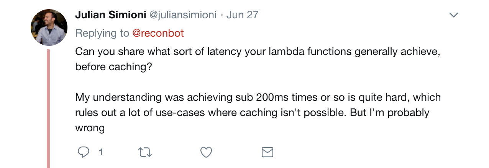

---



---


---


---


---

# We Live in Memory

---

# I 🤷🏻‍♀️ Francis
# I 💻 
# I ❤️ MJS

---

## I 🤷🏻‍♀️ @reconbot
## I 💻 
## I ❤️ JS


---

# Redis Is our Primary Data Store

---

# Redis Is our Primary Data Store

- 1s fsync of AOF
- 1 hour snapshot RDB


---
# Redis Is our Primary Data Store

- 1s fsync of AOF
- 1 hour snapshot RDB

Good enough for Bustle

---

# Every query has a known time complexity

---

- GET Time complexity: O(1)
- ZRANGE Time complexity: O(log(N)+M) with N being the number of elements in the sorted set and M the number of elements returned.
- HMGET Time complexity: O(N) where N is the number of fields being requested.
- ZSCORE Time complexity: O(1)
- HGETALL Time complexity: O(N) where N is the size of the hash.
- ZRANGEBYLEX Time complexity: O(log(N)+M) with N being the number of elements in the sorted set and M the number of elements being returned. If M is constant (e.g. always asking for the first 10 elements with LIMIT), you can consider it O(log(N)).

---

But it's just fast

```js
while (true) {
  const start = Date.now()
  await redis.hgetall('node:fields:8031264')
  console.log(`${Date.now() - start}ms`)
}
```

```
0ms
1ms
0ms
0ms
0ms
0ms
0ms
0ms
1ms
0ms
0ms

```

---

# Shape of the Data Matters


---


---

```js
while (true) {
  const start = Date.now()
  await Promise.all([
    graph.Site.find(1000001),
    graph.Post.find(8031264),
    graph.User.find(1910027),
    graph.Tag.find(1706155),
    graph.Tag.find(1706162),
    graph.Tag.find(2214803)
  ])
  console.log(`${Date.now() - start}ms`)
}
```

---
```
1ms
1ms
1ms
1ms
1ms
1ms
2ms
1ms
1ms
1ms
```
---

all timings are done in our staging environment

r4.2xlarge redis / t2.large nodejs
64 GB memory / whatever

---
```js
const postId = 8031264
const site = await graph.Site.findBy('name', 'BUSTLE')
const [ postEdge ] = await graph.edge.find({
  subject: site,
  predicate: 'SiteHasPost',
  object: { id: postId }
})
const post = graph.Post.FIND(postEdge.object.id)
const [[userEdge], tagEdges] = await Promise.all([
  graph.edge.FIND({ subject: post, predicate: 'PostHasAuthor' }),
  graph.edge.FIND({ subject: post, predicate: 'PostHasTags' })
])
const [user, ...tags ] = await Promise.all([
  graph.User.FIND(userEdge.object.id),
  ...tagEdges.map(({ object: { id } }) => graph.Tag.FIND(id))
])

```
---

I hate that last slide


---

Ok what's a graph?

What's an edge?

ISn't this a join table?

Ohh it's all in memory

What's the basics of how our graphdb works?

Lets see it in graphql

oh hey this is neat!

See ya!

---


No slow queries
Round trip time is the killer so batch your requests
Store your data in a way that matches your access patterns


---

# hi Catherine

sup


----
background
hypothesis
data
results
conclusion
future directions

 -----


User wants a story, they want to know how to pull off dad shoes reaaallly bad
User clicks
Lambda -> LAmbda => Redis => object => eDge => OBJECTS -> Edges => objects -> and back
Flowly skirts are the answer

---

How did that work?

----

GraphQL shapes the data

----

GRaphDB pulls it out for you

----

Node Store

----

Hexastore

----

RDBMS?


----
This is how it can go right, read my story for how it can go wrong

----

Come work at bustle
