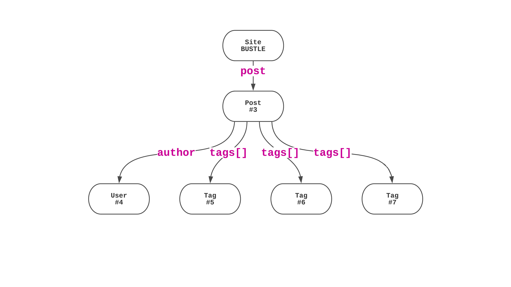

theme: Courier, 2
autoscale: true

# I 👋 Francis
# I 💻 

---

## @reconbot


---

> Hey Francis, How did everyone at Bustle make the website so fast?
--People

---

> We put everything in Redis.
--Francis

---

# We Live in Memory

---


---

# Redis is our Primary Data Store

### But that doesn't make it fast

---

> Redis is an **in-memory data structure store**, used as a database, cache and message broker. It supports data structures such as strings, hashes, lists, sets, sorted sets with range queries...
-- Redis.io(ish)


---

> Hey Francis, isn't that really dangerous?
-- 50/50 chance you'll say this

---

> No
-- 100% chance I'll say this

---

> I don't believe you
-- 100% chance you're thinking this

---

[.build-lists: true]
# [fit] Redis Is our Primary Data Store

- 1s fsync of AOF
- 1 hour snapshot RDB
- Read replicas ready to take over really fast
- Good enough for Bustle's read heavy load

---

# Modeling GraphQL data in a redis GraphDB

### ☝️ is why we're fast

---


---


---


---


---


---


---




---

# GraphDB

^ what if we had a database that let us save and access data like this?

---


---


---

> Oh you mean, like Neo4j right?
-- 99% of you

---

> Sure, but it's faster and doesn't do any of the same things.
-- Francis

---

> Databases like trains aren't slow, the queries like the passengers are slow.
-- Ikai (a DBA) who I guess never took the subway

^ > Trains are not slow they have one speed, people get on & off, the people are slow. Databases aren't slow they have one speed, data goes in and out, the queries are slow.


---

> They're complaining about the database being slow but it's their queries that are slow! They don't know how databases work! Where do they get off accusing the database servers!

---

## Some database are slow, some queries are slow, it's all about tradeoffs

---

# Bustle Traded Query Flexibility for Speed

^ and that's why we replicate from graphDB to BigQuery and elasticsearch

---

# No slow queries¹

[.footer: ¹Ok it's just very hard]

---

> Ok Francis, but how does it work?
-- Get to it already

---

#[fit] Nodes, Edges, and Indexes

---

# Nodes (future)

- GUID (int32)
- Node Type
- `data` as a Compressed Protocol Buffer
- Redis Hash
`{ id, data, updateclock, ...metadata }`
- Update count with a Lua Script to prevent update clobbering

---

# Nodes (now)

- GUID (int32)
- Node Type
- `JSON.stringify()` fields
- Redis Hash
`{ id, ...data, ...metadata }`
- `HGETALL`, `HMSET`


---

# Node JSON

```js
{
  id: 1,
  _nodeType: 'User',
  name: 'Ein',
  bigDeal: true,
  createdAt: 1531334120311,
  updatedAt: 1531334113447
}

```


---
# Edges
[.build-lists: true]

- An edge is `Subject` -> `Predicate` -> `Object`
- An edge is `User` -> `UserHasPost` -> `Post`
- An edge can have weights
`User` -> `UserHasPost(42)` -> `Post`

---

# Edge JSON

```js
{
  subject: 5001,
  predicate: 'UserHasPost',
  object: 40238,
  weight: 42
}
```
---

# Sorted Sets

- Unique strings sorted by a score, then by member
- Think: hash with keys (members) sorted by their numeric values (scores) then by key
- Very fast read/write operations O(log(N))
- Can search by member or score

---

# Edges Hexastore

- 1 big Sorted Set with each edge in 6 orderings
- Pick an ordering and use `zrangebylex` to search

```
      ops:ObjectID:Predicate:SubjectID => 0
      osp:ObjectID:SubjectID:Predicate => 0
      pos:Predicate:ObjectID:SubjectID => 0
      pso:Predicate:SubjectID:ObjectID => 0
      sop:SubjectID:ObjectID:Predicate => 0
      spo:SubjectID:Predicate:ObjectID => 0
```

---


^ [ means get the matches inclusive, this is just SPO

---

# Edges Hexastore

- 6 big Sorted Sets one for each ordering
- 4 bytes === 32bit GUID
- 4 bytes === sha256(predicate).slice(0, 4)
- 12 Byte Binary packed key `SSSSPPPPOOOO`
- Binary Packing saved 70% of memory
- still use `zrangebylex` to searching the members

---

# Edges Weighted Store

- Can store a weight on an edge
- `Site -> HasPublishedPost(publishedAt) -> Post`
- Can only search `SP*` or `OP*`
- Can search ranges of weights (eg, posts published today)
- Lots of tiny Sorted Sets
- Faster because of the smaller "n" in `O(log(n))`

---
# Edges Weighted Store

Each edge is stored two different ways

```
Key                                | Member    | Score
"edge:s:${subjectId}:${predicate}" | objectId  | weight
"edge:o:${objectID}:${predicate}"  | subjectId | weight
```

---


---

# Indexes

- `node:id` Sorted set of all node IDs
- `${type}:id` Sorted set of all node IDs of a type
- `${type}:${field}` Sorted set of unique values to ids

---

> How fast is it?
--Me

---

# Loading Nodes is fast

```js
while (true) {
  const start = Date.now()
  await graph.Site.find(1000001)
  console.log(`${Date.now() - start}ms`)
}
```


^ It matters when you decide how to store your data layer, not really when you decide to use your data layer

---
# Loading all the nodes is fast

```js
while (true) {
  const start = Date.now()
  await Promise.all([
    graph.Site.find(1000001),
    graph.Post.find(8031264),
    graph.User.find(1910027),
    graph.Tag.find(1706155),
    graph.Tag.find(1706162),
    graph.Tag.find(2214803)
  ])
  console.log(`${Date.now() - start}ms`)
}
```


---
## Command Batching Makes Redis Fast


---
# Not covered: ORM & Schemas

```js
import { edge, Post, User } from './graph'
const ein = await User.create({ name: 'Ein the Dog', meta: {}})
const post = await Post.findBy('path', '/p/10-reasons-why-dogs-are-the-best')
await edge.create({
  subject: post,
  predicate: 'HasAuthor'
  object: ein
})

const authors = edge.makeIterator({ subject: post, predicate: 'HasAuthor'})
for await (author in authors) {
  await giveTreat(author)
}
```
---

# Not covered:

- Interfaces and Mixin Inheritance
- Typed Edge validations
- Named Edges (unique text values between two nodes)
- The many different Failures and Bugs in production and how we mitigate them

---

# In Conclusion

---

# The secret of Dad shoes is a flowy skirt


---
# In Conclusion

- Don't make slow queries possible
- Round trip time is a killer so batch your requests
- Store your data in a way that matches your access patterns

---

# Related Open Source

- [`bluestream`](https://github.com/bustle/bluestream) Streams for Async functions
- [`mobiledoc-kit`](https://github.com/bustle/mobiledoc-kit) A toolkit for building WYSIWYG editors with Mobiledoc
- [`SAMMIE`](https://github.com/bustle/sammie#readme) Serverless Application Model Made Infinitely Easier
- [`shep`](https://github.com/bustle/shep) A framework for building JS Applications with AWS API Gateway and Lambda
- [`streaming-iterables`](https://github.com/reconbot/streaming-iterables) Replace your streams with async iterators
- [`redis-loader`](https://github.com/bustle/redis-loader) An ioredis-like object that batches commands via dataloader

---

#[fit] We Live In Memory
## (the story)
#[fit] rbrtr.com/post/1911

---
# Thanks 👏


[.footer: We're hiring!]
